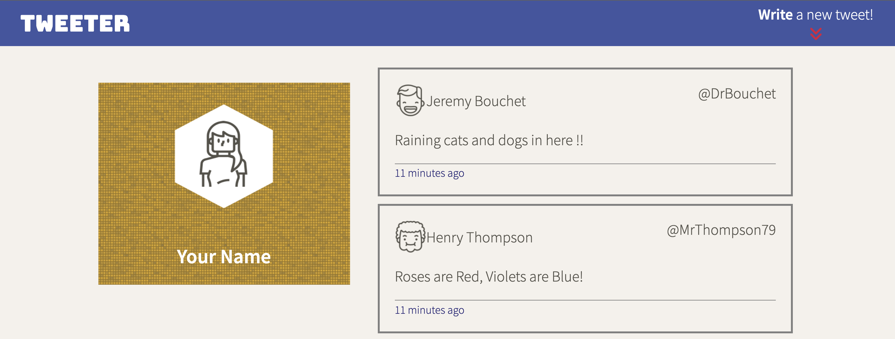
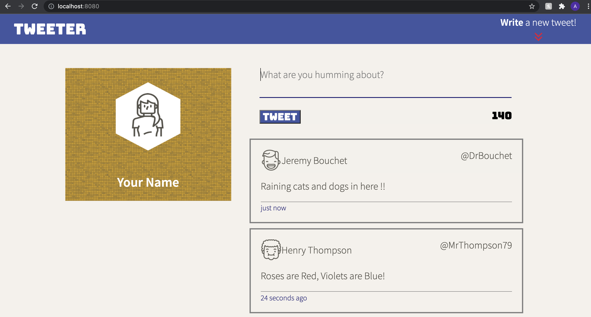
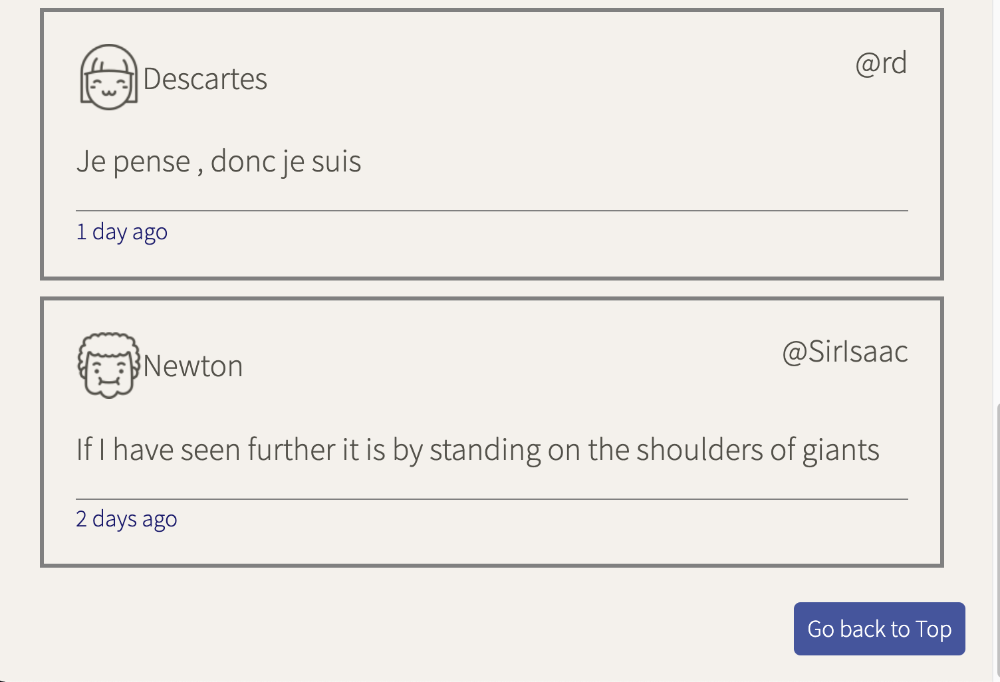

# Tweeter

Tweeter is a simple, single-page Twitter clone.

## Getting Started

1. Fork this repository, then clone your fork of this repository.
2. Install dependencies using the `npm install` command.
3. Start the web server using the `npm run local` command. The app will be served at <http://localhost:8080/>.
4. Go to <http://localhost:8080/> in your browser.

## Dependencies
- Express
- Node 5.10.x or above
- body-parser
- chance
- express
- jquerry
- md5
- require
- timeago

## Screenshots

